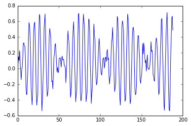
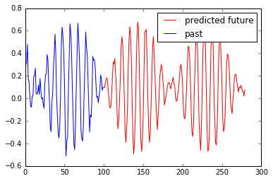

# Simple sequencing with DeepSeries regression

### In this example we show how to train on a one-dimensional time series and predict an arbitrary number of future steps in the sequence.


```python
import numpy as np
import os, sys
%matplotlib inline
import matplotlib.pyplot as plt
from deepseries import deepseries, preprocessing
```


```python
# Create mock data. For example, two coupled sinusoids:
Ncycles = 1000; Npoints = 10000; tau1 = 1; tau2 = 0.06
x_mock = np.linspace(0,Ncycles*2*np.pi,Npoints)
y_mock = np.sin(x_mock*tau1)*np.sin(x_mock*tau2)*.6
# add a bit of noise
y_mock += np.random.random(y_mock.size)*.2
# inspect plot
plt.plot(x_mock[:300],y_mock[:300])
```


    [<matplotlib.lines.Line2D at 0x110429b90>]





```python
# Break the sequence into chunks of `sequence_length`, and reshape as (N_samples, sequence_length, N_channels=1)
X, y = preprocessing.Slicer().fit(y_mock,sequence_length=100,kind='seq2seq')

# train-test split. The test data would be the trailing 20% of points in the full series
split_index = int(0.8*FX.shape[0])
Xtrain, Xtest, ytrain, ytest =  X[:split_index], X[split_index:], y[:split_index], y[split_index:]
```


```python
# Initialize DeepSeries sequencer with regression learning
dsr = deepseries.Sequencer(Xtrain, ytrain, Xtest, ytest,
    Nnodes=40,
    Nlayers=2,
    input_keep_prob=0.9,
    output_keep_prob=0.9,
    optimizer_type='AdamOptimizer',
    optimizer_kwargs={'learning_rate':0.001},
    cell_kwargs = {'use_peepholes':False,
                   'forget_bias':1,
                   'state_is_tuple':True},
    batch_size=50,
    cell_type='LSTMCell',
    tracking_step=30)
```

    /Users/ezw112/miniconda2/envs/tensorflow/lib/python2.7/site-packages/tensorflow/python/ops/gradients.py:90: UserWarning: Converting sparse IndexedSlices to a dense Tensor of unknown shape. This may consume a large amount of memory.
      "Converting sparse IndexedSlices to a dense Tensor of unknown shape. "


```python
# Train regressor. If this is your first time running it, try just one epoch to test the computation time.
dsr.fit(n_epochs=10)
```

    train batch cost: 3.814, test cost: 3.752
    train batch cost: 1.404, test cost: 1.436
    train batch cost: 0.920, test cost: 0.920
    train batch cost: 0.790, test cost: 0.780
    train batch cost: 0.669, test cost: 0.693
    train batch cost: 0.664, test cost: 0.629
    train batch cost: 0.581, test cost: 0.616
    train batch cost: 0.602, test cost: 0.585
    train batch cost: 0.555, test cost: 0.557
    train batch cost: 0.558, test cost: 0.536
    train batch cost: 0.517, test cost: 0.523
    train batch cost: 0.523, test cost: 0.514
    train batch cost: 0.534, test cost: 0.516
    train batch cost: 0.481, test cost: 0.510
    train batch cost: 0.534, test cost: 0.504
    train batch cost: 0.510, test cost: 0.501
    train batch cost: 0.521, test cost: 0.498
    train batch cost: 0.528, test cost: 0.490
    train batch cost: 0.482, test cost: 0.489
    train batch cost: 0.483, test cost: 0.487
    train batch cost: 0.473, test cost: 0.475
    train batch cost: 0.479, test cost: 0.475
    train batch cost: 0.466, test cost: 0.466
    train batch cost: 0.455, test cost: 0.467
    train batch cost: 0.487, test cost: 0.467
    train batch cost: 0.481, test cost: 0.458
    train batch cost: 0.468, test cost: 0.448
    train batch cost: 0.442, test cost: 0.440
    train batch cost: 0.430, test cost: 0.434
    train batch cost: 0.443, test cost: 0.431
    train batch cost: 0.449, test cost: 0.430
    train batch cost: 0.422, test cost: 0.425
    train batch cost: 0.425, test cost: 0.419
    train batch cost: 0.434, test cost: 0.412
    train batch cost: 0.379, test cost: 0.404
    train batch cost: 0.407, test cost: 0.400
    train batch cost: 0.396, test cost: 0.396
    train batch cost: 0.406, test cost: 0.398
    train batch cost: 0.385, test cost: 0.392
    train batch cost: 0.358, test cost: 0.381
    train batch cost: 0.393, test cost: 0.373
    train batch cost: 0.355, test cost: 0.370
    train batch cost: 0.371, test cost: 0.365
    train batch cost: 0.386, test cost: 0.366
    train batch cost: 0.349, test cost: 0.362
    train batch cost: 0.339, test cost: 0.359
    train batch cost: 0.357, test cost: 0.349
    train batch cost: 0.350, test cost: 0.343
    train batch cost: 0.319, test cost: 0.341
    train batch cost: 0.316, test cost: 0.335
    train batch cost: 0.316, test cost: 0.333
    train batch cost: 0.320, test cost: 0.331
    train batch cost: 0.322, test cost: 0.331
    train batch cost: 0.313, test cost: 0.335
    train batch cost: 0.334, test cost: 0.331
    train batch cost: 0.342, test cost: 0.327
    train batch cost: 0.332, test cost: 0.322
    train batch cost: 0.322, test cost: 0.327
    train batch cost: 0.315, test cost: 0.327
    train batch cost: 0.317, test cost: 0.321


```python
# Now that we have a trained machine, let's take
# an end chunk of the test data and have the network
# predict future values.
N_points_to_predict = 180
prediction = dsr.unroll(Xtest[-1:], n_output=N_points_to_predict)
```


```python
# Plot the future vs past
past_sequence = Xtest[-1:].ravel()
past_plus_future_sequence = np.r_[[np.nan]*past_sequence.size, prediction.ravel()]
plt.plot(past_plus_future_sequence, color='r', label='predicted future')
plt.plot(past_sequence, color='blue', label='past')
plt.legend()
```


    <matplotlib.legend.Legend at 0x1101bd790>



